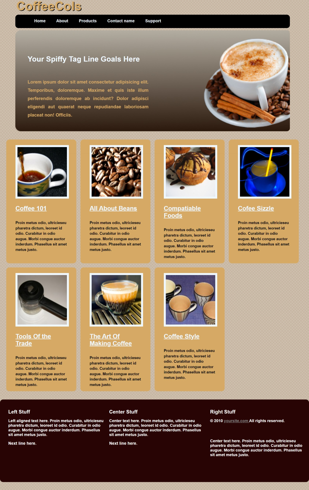

# CollsCofee

CollsCofee is a web application for managing a coffee shop. It provides features to handle various aspects of a coffee shop's operations, including menu management, order tracking, and customer management.

## Features

- Manage the coffee shop's menu, including adding, updating, and deleting menu items.
- Track and process customer orders, including order status updates and order history.
- Manage customer information, including adding new customers and updating their details.
- Generate reports and statistics for sales, popular items, and customer preferences.

## Technologies Used

- HTML
- CSS
- JavaScript

## Installation

1. Clone this repository to your local machine or web server.
2. Launch the application by opening the `index.html` file in a web browser.

Feel free to customize and enhance the project according to your specific requirements.
